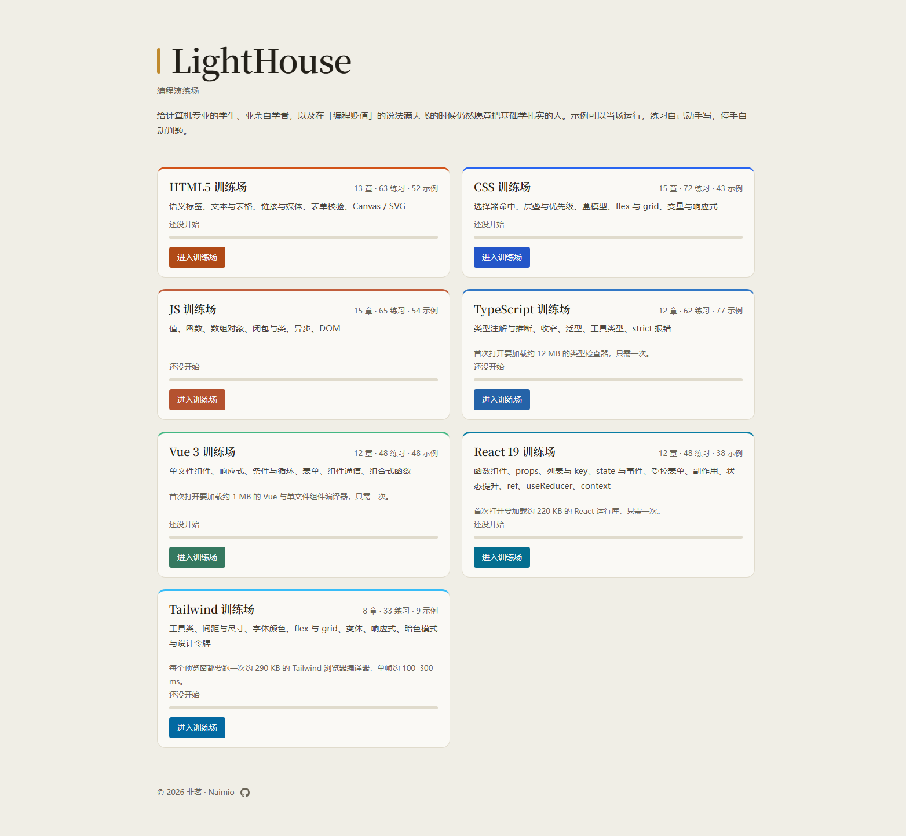

# LightHouse

一个入口页 + 若干座各自独立的离线演练场。每座站都是同一套做法：顺着章节读 → 示例当场运行 → 练习自己动手写 →
停手自动判题 → 断言逐条给出期望与实际。没有注册，没有后端，没有构建步骤，进度只存在你自己的浏览器里。

仓库对「有几座站、都是什么领域」不作假设：加一座新站 = 新建目录 + 在 `tools/labs.json` 里加一条
（步骤见 `docs/01-merge-architecture.md`）。目前是 HTML5、CSS、JS、TypeScript、Vue 3、React 19、Tailwind 七座；
往后要加别的语言（包括需要服务端判题的）该怎么走，见 `docs/03-languages-and-scale.md`。

## 怎么打开

| 方式 | 做法 |
|---|---|
| 在线看（推荐） | **https://naimiochan.github.io/LightHouse/** —— 各座站都在这里，进度照样记（同一域名下） |
| 起本地服务 | 双击 `run.bat`，浏览器打开 `http://127.0.0.1:8876/index.html?v=<每轮不同的令牌>`；关掉页面后命令行窗口自己关 |
| 完全离线 | 双击 `index.html`（`file://` 直开，每座站都支持） |
| 只跑某一座站 | 进那座目录双击它自己的 `run.bat`（端口 8877–8884），互不干扰 |

**在线就够了**：站点没有任何后端，GitHub Pages 上跑的就是这套文件，各座站在同一个域名下，入口页一样读得到进度。
本地服务只在三种情况下有用——没有网、在改内容想立刻看到效果、或者要跑校验脚本（`tools/` 里的东西要 node 与本地服务）。

入口页按每座站自己的进度显示「已通过 N / M」，并按「第一个没做完的章」给出「继续 · 第 N 章」。

手机上也能用：窄屏（≤900px）目录栏收成顶栏左侧的「目录」抽屉，正文拿回整屏；
宽表在表格自己那一行横向滚动，编辑器字号提到 16px（不然手机浏览器会放大整页）。
七座站共用同一套形态，规则与验收点见 `docs/04-mobile-layout.md`。

## 已有的演练场

| 站 | 规模 | 教什么 | 前置 | 目录 |
|---|---|---|---|---|
| HTML5 训练场 | 13 章 · 63 练习 · 52 示例 · 253 断言 | 文档骨架与语义分区、文本/列表/表格、链接与媒体、表单与校验、Canvas/SVG、本地存储、无障碍 | 零基础 | `html5-lab/` |
| CSS 训练场 | 15 章 · 72 练习 · 43 示例 · 219 断言 | 选择器命中、层叠与优先级、盒模型、flex 与 grid、变量与响应式、过渡与状态、混合与遮罩、滚动驱动、滤镜 | 认得出 HTML 标签 | `css-lab/` |
| JS 训练场 | 15 章 · 65 练习 · 54 示例 · 223 断言 | 值与类型、分支循环函数、数组对象字符串、闭包类错误、异步、DOM、指针与动效编排 | HTML 与 CSS 各过一遍 | `js-lab/` |
| TypeScript 训练场 | 12 章 · 62 练习 · 77 示例 · 219 断言 | 类型注解与推断、收窄、接口与泛型、工具类型、类与守卫、strict 报错与模块 | 会写基本 JS | `ts-lab/` |
| Vue 3 训练场 | 12 章 · 48 练习 · 48 示例 · 203 断言 | 单文件组件、响应式与计算属性、条件与列表、事件与表单、组件通信、生命周期 | 会写基本 JS 与 HTML | `vue-lab/` |
| React 19 训练场 | 12 章 · 48 练习 · 38 示例 · 188 断言 | 函数组件、props 与不可变、列表与 key、state 与事件、受控表单、派生值与条件渲染、副作用与清理、状态提升、ref 与 DOM、样式、useReducer、context | 会写基本 JS 与 HTML | `react-lab/` |
| Tailwind 训练场 | 8 章 · 33 练习 · 9 示例 · 98 断言 | 工具类词表、间距与尺寸、字体与颜色、flex 与 grid、组件组合、变体、断点前缀、暗色模式与 `@theme` 令牌 | 认得出 HTML 与基本 CSS | `tailwind-lab/` |

合计 87 章 · 391 个练习 · 321 个示例 · 1403 条练习断言。这些数字由 `tools/build-manifest.mjs` 从各站内容里读出来生成到
`assets/js/manifest.js`，入口页只读这份清单；改动内容后重跑生成器，数字不会过期。

断言那一栏数的是**练习里的断言**，示例自带的断言不计入。`ts-lab`、`vue-lab`、`react-lab` 自己的 `verify-content.mjs`
报的数字更大，因为那几份把示例里的断言也算上了（React 站报 327）。



（宽屏两列；窄屏一列见 `docs/screenshot-portal-narrow.png`。两张都是校验脚本 `node tools/verify-portal.mjs --shots` 截的整页图，七张卡与页脚都在里面。）

## 目录结构

```
LightHouse/
├─ index.html                 入口页（总目录）
├─ assets/css/portal.css      入口页样式（设计令牌的唯一来源是 DESIGN.md）
├─ assets/js/manifest.js      生成的清单：各站的规模、章节、进度键（别手改）
├─ assets/js/portal.js        入口页逻辑：渲染卡片 + 读各站进度
├─ serve.py  run.bat          根服务：一个端口服务全部，页面关掉窗口跟着关
├─ tools/
│  ├─ labs.json               各站的文字（标题、一句话、进度键、颜色令牌名）
│  ├─ build-manifest.mjs      清单生成器
│  ├─ verify-manifest.mjs     清单与内容逐字节对账
│  ├─ verify-all.mjs          各站的 node 侧校验（内容契约、括号配对、类型判题、SFC 改写内核、React 运行时自检）
│  ├─ verify-portal.mjs       真浏览器验收：入口页 + 各站入口页 + 进度分支
│  └─ lib/cdp.mjs             起服务、起无头 Edge、连 CDP 的公共骨架
├─ docs/                      合并架构、校验分层、语言与规模、手机版式、方向评估与实测数据
├─ html5-lab/  css-lab/  js-lab/  ts-lab/  vue-lab/  react-lab/  tailwind-lab/
│     每座站自带 AGENTS.md / DESIGN.md / 内容契约 / 引擎 / tools / serve.py / run.bat；
│     ts-lab、vue-lab、react-lab、tailwind-lab 另有 vendor/ 放第三方产物
│     （类型检查器、Vue 运行时与 SFC 编译器、React 运行时、Tailwind 浏览器编译器）
└─ DESIGN.md  AGENTS.md  LICENSE
```

前四座站在并入时**一个字节都没改**（并入前用 `diff -r` 逐字节比对过）。它们各自带 `AGENTS.md`、`DESIGN.md`、
内容契约、校验脚本与自己的 `serve.py`，可以单独拿出来跑；合并只加了门厅，没有动屋子（见 `docs/01-merge-architecture.md`）。
`vue-lab` 是并入之后写的第五座，`react-lab` 是第六座，`tailwind-lab` 是第七座，自身同样自洽，只是不经过「字节保真搬运」这一步；它们接入时跑过的对账记在
`docs/02-verification.md`。

## 校验

```bash
node tools/verify-manifest.mjs     # 清单是否与内容同步、入口页有没有写死某一座站（重算一遍逐字节比对）
node tools/verify-all.mjs          # 各站的 node 侧校验：内容契约、括号配对、类型判题、SFC 改写内核、React 运行时自检（含各站 serve.py 的关窗即退）
node tools/verify-portal.mjs       # 真浏览器：入口页与七座站入口页、进度显示、资源无 404、file:// 直开
```

改过某一座站的内容或引擎后，还要在那座目录里跑它自己的真浏览器验收（最权威，也最慢）。每座都有一支
`verify-content.mjs`（内容契约）与一支 `verify-ui.mjs`（真实按键、四档视口），此外各有自己专门的一支：

```bash
cd html5-lab && node tools/verify-browser.mjs   # 真渲染的几何与声明（css-lab 同款）
cd js-lab    && node tools/verify-ui.mjs        # 打字 → 自动运行 → 断言与进度
cd ts-lab    && node tools/verify-judge.mjs     # 真类型诊断、等价判定（另 verify-types.mjs）
cd vue-lab   && node tools/verify-browser.mjs   # http 与 file:// 各跑一遍全部练习（另 verify-compile.mjs）
cd react-lab && node tools/verify-browser.mjs   # http 与 file:// 各跑一遍全部练习（另 verify-compile.mjs / verify-vendor.mjs）
cd tailwind-lab && node tools/verify-browser.mjs # http 与 file:// 各跑一遍全部练习（另 verify-vendor.mjs）
```

分层与各脚本覆盖面见 `docs/02-verification.md`。

## 诚实说明的限制

- **TypeScript 站首次打开要加载约 12 MB 的类型检查器**（`ts-lab/vendor/`）。只需一次，之后每次判题 2–8 ms；
  `file://` 直开也能用。这也是本仓库 18.3 MB（`git ls-files` 口径）里的大头，这个目录占 12.0 MB。
- **Vue 站首次打开要加载约 1 MB 的 Vue 运行时与单文件组件编译器**（`vue-lab/vendor/`，两个源码字符串包合计 0.94 MB）。
  只需一次；`file://` 下也能加载（外链 `<script src>` 在 `file://` 读不到，所以这两个包是以源码字符串入库的）。
- **React 站首次打开要加载约 220 KB 的 React 运行库**（`react-lab/vendor/`，`react19.iife.min.js` 224 KB 加它
  对应的源码字符串包）。只需一次；`file://` 下也能加载，理由同上。React 19 没有 UMD，这一份是把
  `react` + `react-dom` + `react-dom/client` + `htm` 打成单入口 IIFE，模板用 `htm` 而不是 JSX。
- **Tailwind 训练场每个预览窗都要跑一次浏览器编译器**（`tailwind-lab/vendor/`，产物 282 KB 加源码字符串包）。
  首屏关键路径上没有这 282 KB；打开一章时多张预览卡同时渲染，单帧生成样式约 100–300 ms，两阶段练习要编译两次。
- **判题不是编译器级完备的**：JS/HTML/CSS 的练习跑在 `sandbox="allow-scripts"` 的 iframe 里，
  死循环会被 5 秒超时掐掉（页面会提示「可能是循环没写终止条件」），异步示例最多等 1.5 秒。
  控制台输出格式与 DevTools 不完全一致。
- **入口页的目录需要 JavaScript**：关掉 JS 时页面只剩标题、简介与一行提示；每座站的 `index.html` 仍可直接打开。
- **各座站的引擎没有合并**，代码有重复（每座站一份高亮/编辑器逻辑）。它们已经各自演化出不同能力，
  强行统一是纯粹的回归风险；要不要抽公共内核是另一件事，见 `docs/01-merge-architecture.md`。
- **进度只看得到同一浏览器**：存在 `localStorage`，换浏览器或清缓存就回到零。入口页只读，不提供重置
  （重置在每座站自己的顶栏里）。

## 致谢

各座训练场目录栏底部的「快速参考」入口指向 [quickref.me](https://quickref.me/zh-CN/index.html)，那里收了一百多种语言与工具的备忘清单，中文版由社区翻译维护。本仓库只做外链，不复制它的内容；断网时点过去就是打不开，不影响各站自己的功能。

## 许可

MIT，见 `LICENSE`。各站 `vendor/` 里的第三方产物随附各自的许可文本（TypeScript 为 Apache-2.0，Vue 运行时、React 运行时与 Tailwind 浏览器编译器为 MIT）。
