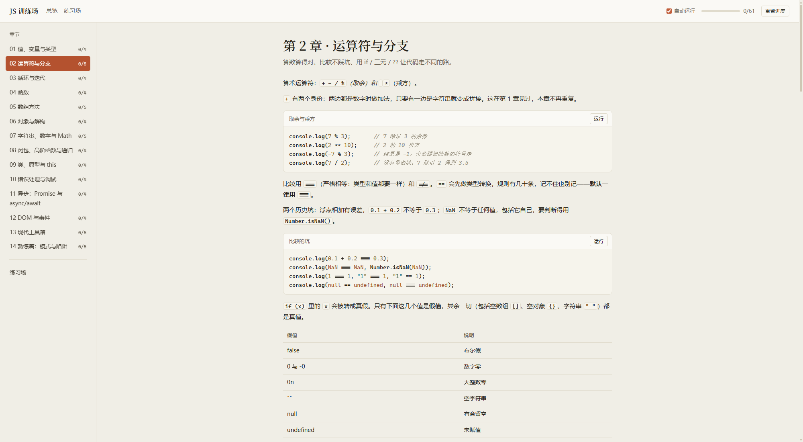
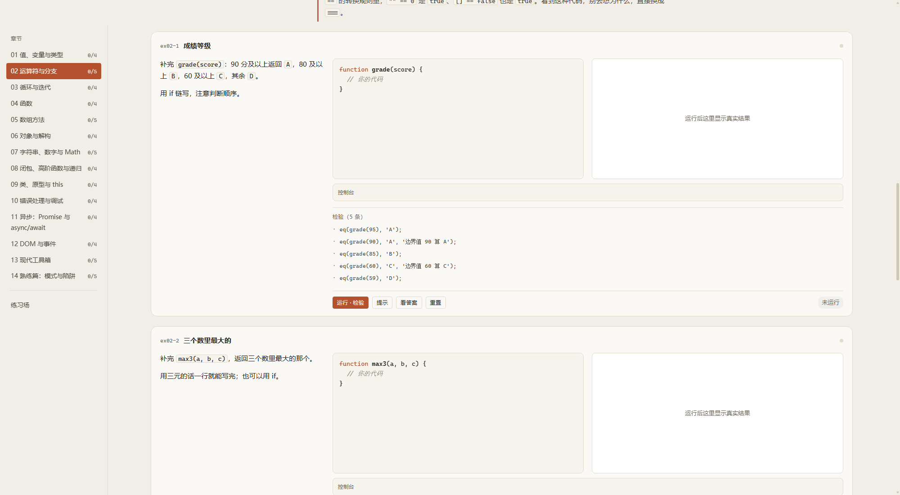
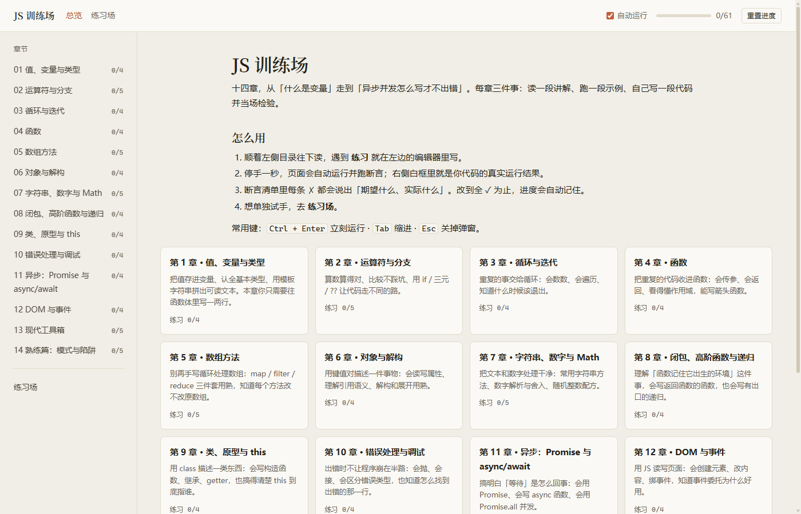

# JS 训练场

把 JavaScript 从入门学到能动手写：每一条结论都能当场跑一遍。

15 章、65 个练习、54 个可运行示例，纯静态页面，离线可用。每章三件事：读一段讲解、跑一段示例、自己写一段代码并当场检验。



## 怎么打开

双击 `run.bat` 即可：它起一个本地服务并打开页面。关掉浏览器里这个页面，命令行窗口会自己关掉。

页面地址形如 `http://127.0.0.1:8877/index.html?v=ab12cd`，末尾的令牌每轮都不同。这是有意的：浏览器把 URL 当缓存键，固定 URL 会复用上一轮的旧页面。服务返回的 HTML 也禁止缓存，并顺手清掉本站旧缓存（练习进度不受影响）。若页面顶部出现橙色「缓存旧版本」提示条，按一次 `Ctrl+Shift+R` 即可。

没有 Python 也能用：直接双击 `index.html`，功能一样。

| 方式 | 需要什么 | 关窗后 |
|---|---|---|
| `run.bat` | Python 3（标准库即可） | 服务与命令行窗口自动退出 |
| 双击 `index.html` | 浏览器 | 无服务进程 |

## 怎么用

1. 顺着左侧目录往下读，遇到练习就在左边的编辑器里写。
2. 停手约一秒会自动运行并跑断言，右侧白框里是代码真实的运行结果。
3. 断言清单逐条给 ✓ / ✗，失败的那条会写出「期望什么、实际什么」。
4. 想单独试手，去左侧「练习场」。



进度与练习代码存在浏览器 `localStorage`（key 前缀 `jslab.v1.`），没有后端。

## 章节

左侧目录与总览页都按这个顺序排：



| 章 | 内容 | 练习 |
|---|---|---|
| 1 | 值、变量与类型 | 4 |
| 2 | 运算符与分支 | 5 |
| 3 | 循环与迭代 | 4 |
| 4 | 函数 | 4 |
| 5 | 数组方法 | 5 |
| 6 | 对象与解构 | 4 |
| 7 | 字符串、数字与 Math | 5 |
| 8 | 闭包、高阶函数与递归 | 4 |
| 9 | 类、原型与 this | 4 |
| 10 | 错误处理与调试 | 4 |
| 11 | 异步：Promise 与 async/await | 4 |
| 12 | DOM 与事件 | 4 |
| 13 | 现代工具箱（Map/Set、生成器、JSON、正则） | 5 |
| 14 | 熟练篇：模式与陷阱 | 5 |
| 15 | 指针与动效编排 | 4 |

## 目录结构

```
index.html            外壳（按顺序加载引擎与 15 章内容）
run.bat               双击入口：跑 serve.py（纯 ASCII）
serve.py              本地静态服务：每轮换入口令牌，页面关掉后自己退出
AGENTS.md             给 agent 的硬约束（架构铁律、写作规范、禁区）
DESIGN.md             设计令牌与视觉规则（色值/字体的唯一来源）
docs/01-content-schema.md   内容契约：章节/段落/练习的字段定义
assets/css/           base.css（令牌+排版）、app.css（布局+组件）
assets/js/
  sandbox.js          沙箱内核（唯一执行入口，浏览器与 node 共用同一份代码）
  runner.js           把一次运行送进 sandbox iframe
  highlight.js        语法高亮
  render.js           迷你 markdown + 章节/示例/练习渲染
  app.js              路由、目录、进度、保活连接、自测钩子
content/chNN-*.js     全部教学内容（改内容只动这里）
tools/verify-content.mjs   内容校验：schema、断言、示例输出
tools/verify-ui.mjs        浏览器验收：真实输入、三档视口排版、全量自测
tools/verify-quit.mjs      关窗即退出：SSE 生命周期与端口复用
tools/verify-fresh.mjs     进站新鲜度：缓存毒化后新入口仍拿到最新代码
```

## 校验

```bash
node tools/verify-content.mjs     # 快：schema + 参考答案必须全过 + 示例输出逐字比对
node tools/verify-ui.mjs          # 慢：起服务与无头 Edge，真实输入流程 + 三档视口排版 + 全量自测
node tools/verify-ui.mjs --fast   # 跳过全量自测
node tools/verify-quit.mjs        # 关掉页面后服务真的退出、端口能立刻复用
node tools/verify-fresh.mjs       # 毒化浏览器缓存后，新入口拿到的仍是最新代码
```

改任何 `content/*.js` 后至少跑第一条。浏览器控制台里也可以执行 `await JSLAB_SELFTEST()`：
它用参考答案和起始代码各跑一遍全部练习（含 DOM 类），确认「参考答案能过、起始代码能被抓住」。

## 加一章

1. 新建 `content/chNN-name.js`，照 `docs/01-content-schema.md` 的结构写，文件头尾带 UMD 包装。
2. 在 `index.html` 里加一行 `<script src="content/chNN-name.js"></script>`（放在 `assets/js/app.js` 之前）。
3. 跑 `node tools/verify-content.mjs`，红了按提示改。

## 沙箱与进度

用户代码跑在 `sandbox="allow-scripts"` 的 iframe 里，超时上限 5 秒。写死循环时，页面在掐掉它之前会卡一下，控制台会说明原因。示例里的异步尾巴（定时器）最多再等 1.5 秒。沙箱内的控制台把对象与数组按简化格式打印，和 DevTools 的样式不同。进度与练习代码只在本机浏览器里，换浏览器或清缓存就没了；通过 `run.bat` 进入时服务会顺手清理 HTTP 缓存，不会动这些进度数据。
